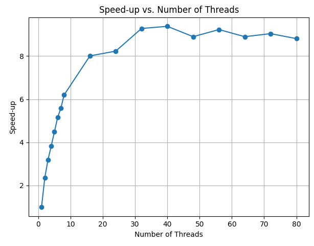

## Discussion

Although adding threads speeds up the parallel portion of our hash computation, overall gains plateau (and can even dip) as we add more cores. According to Amdahl’s Law, any fraction **s** of work that must run serially bounds the maximum speed-up:

$$
\text{speed-up}_{\max} = \frac{1}{\,s + \frac{1 - s}{n}\,}.
$$
| Thread Count | Wall Clock Time | User Time | System Time | Speed- up | 
------------- |:-------------:|------------- |:-------------: |-------------|
|1|17.54|14.02| 0.89|1.00|
|2| 7.47|13.84| 0.61| 2.35|
|3| 5.49|14.77| 0.68| 3.19|
|4| 4.58|15.81| 0.88| 3.83|
|5| 3.91|16.34| 1.01| 4.49|
|6| 3.40|16.48| 1.08| 5.16|
|7| 3.14|17.27| 1.12| 5.59|
|8| 2.83|17.33| 1.28| 6.20|
|16| 2.19|18.49| 3.10| 8.01|
|24| 2.13|19.48| 5.84| 8.23|
|32| 1.89|18.55|14.36| 9.28|
|40| 1.87|17.59|22.77| 9.38|
|48| 1.97|17.62|19.47| 8.90|
|56| 1.90|17.05|27.86| 9.23|
|64| 1.97|17.23|21.08| 8.90|
|72| 1.94|17.15|25.93| 9.04|
|80| 1.99|16.92|21.54| 8.81|

###### Question 1
Notice that there is a maximum speed-up factor, but not necessarily using the most threads. Make a guess (i.e., write a short paragraph) as to why you think more threads aren’t necessary better. Here’s a hint: think about a group of people waiting to go through a turnstile (like at BART or Disney World). Are more people able to go through it just because there are more people?

Even though adding threads increases the amount of work that can be done in parallel, there comes a point where throwing on more “workers” actually stops improving, or even hurts, performance. That’s because there’s still some serial work (and synchronization) that every thread must wait for—just like a group of people queued up at a single turnstile: piling more people behind the gate doesn’t make them go through any faster, it just makes the line longer. In our program the “turnstile” is the code that’s not threaded (plus the mutex locks around the shared data and the cost of scheduling dozens of threads), so once you hit the point where the parallel portion is fully saturated, extra threads only add contention and overhead, flattening out the speed-up curve.

## Graph speed-up vs. thread count

###### Question: Do you think it’s possible to get “perfect scaling” — meaning that the (1-p) terms is zero?

###### Question: For your own timings, compute your expected speed-up for 16 cores. 

######  Question: in reviewing the graph of speed-ups to number of threads, note that we get pretty linear (when you plot the dots, they’re pretty close to being a line) speed-up. What’s the slope of that line? (Pick two values, like for one and seven threads, and do the rise-over-run thing you learned in Algebra). Does that linear trend continue as we add more threads? What do you think causes the curve to “flatten out” when we use large thread counts?
